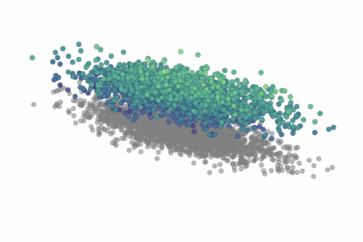
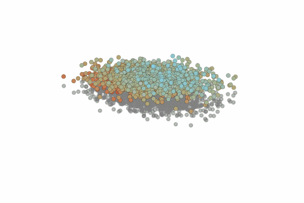

# Wasserstein Flow Matching

Flow Matching on point-clouds and Gaussians. Please read our work for more details : [Wasserstein Flow Matching](https://arxiv.org/abs/2411.00698).

This implementation is written in Python3 and relies on FLAX, JAX, & JAX-OTT.

## Examples

<p align="center">
  
  
  
</p>

## Installation

To install JAX, simply run the command:

    pip install --upgrade "jax[cuda12_pip]" -f https://storage.googleapis.com/jax-releases/jax_cuda_releases.html

Alternatively, run the following if you're using `uv`:

```bash
$ uv venv --python 3.11
$ source .venv/bin/activate
$ uv pip install -U jax[cuda12] jaxlib flax optax ott-jax torch jupyter wandb pandas matplotlib tqdm mdtraj
```

And to install WassersteinFlowMatching along with the rest of the requirements, please clone this repo. For detailed guides, please follow provided notebooks in the tutorials folder.